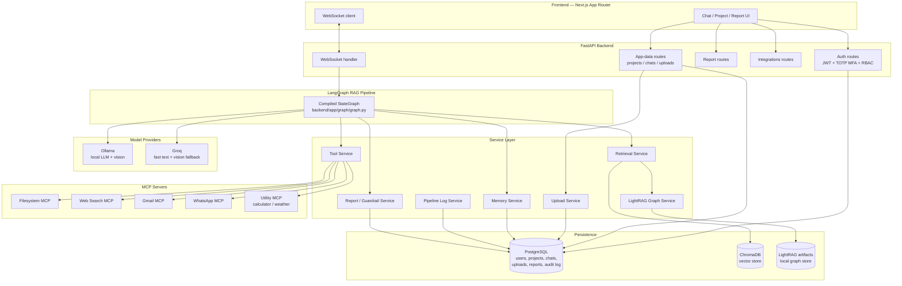
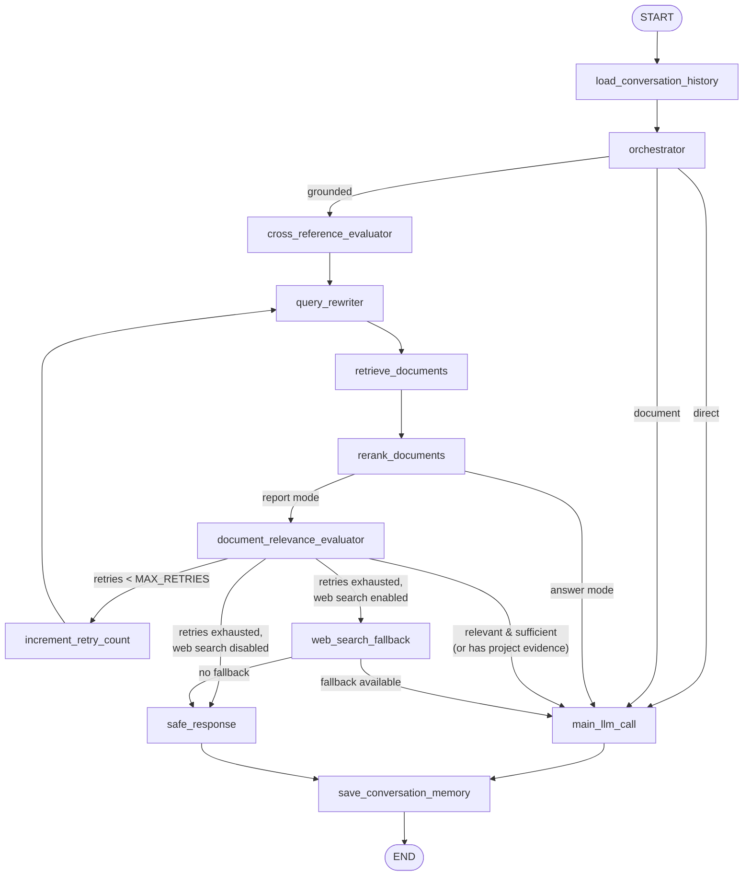

# AuditReady AI

AuditReady AI is a locally runnable multimodal supplier-compliance copilot for Pakistan-based textile and leather factories. It is designed for exporters, buying houses, consultants, and U.S./EU sourcing teams that want a cheaper pre-audit screening pass before paying for a buyer or certification audit.

The product accepts text plus optional factory-floor photos, scanned records, and policy documents; it traces a LangGraph pipeline node by node; retrieves clause-grounded evidence from a local knowledge base; and produces a structured pre-audit report that classifies likely findings as `Major`, `Minor`, `Compliant`, or `Needs More Evidence`.

> Important: the app is a pre-screening gap-catcher, not a guarantee of conformity. Real audits should still include worker interviews, payroll checks, and deeper on-site verification.

## What this project does

- Creates project workspaces for supplier and audit-prep cases
- Supports chat threads, uploads, saved reports, and file reuse across chats
- Accepts text, image, PDF, DOCX, and TXT evidence
- Runs a grounded RAG pipeline with local retrieval and graph-aware context
- Produces structured findings with citations and remediation suggestions
- Streams pipeline events over WebSocket for a live demo workflow
- Persists users, projects, uploads, reports, and pipeline telemetry in PostgreSQL
- Supports optional MCP integrations for file export, web search, and communication workflows

## Target use case

This repository is aimed at:

- factory managers and QA leads
- compliance officers and sourcing teams
- buying houses and exporter-facing consultants
- Pakistan-based factories preparing for WRAP, SMETA/Sedex, amfori BSCI, and OEKO-TEX-style reviews

## Tech stack

| Layer | Choices |
|---|---|
| Backend | FastAPI, SQLAlchemy, Pydantic, LangGraph, Typer (CLI) |
| RAG / retrieval | ChromaDB (vectors), LightRAG-style local graph artifacts, sentence-transformers embeddings, NetworkX |
| LLM providers | Ollama (local text + vision), Groq (fast text + vision fallback) |
| Frontend | Next.js App Router, TypeScript, React 19, WebSocket-driven live pipeline UI |
| Database | PostgreSQL (users, projects, chats, uploads, reports, audit log, pipeline telemetry) |
| Security | JWT access tokens, persisted refresh tokens, TOTP MFA (`pyotp`), RBAC, Fernet-encrypted upload/text storage, append-only audit log |
| MCP tools | Filesystem MCP, Web Search MCP (DuckDuckGo/SearXNG), Gmail MCP, WhatsApp MCP, Utility MCP (calculator, weather) |

### What makes this project distinct

- **Deterministic retry/abstention loop** — the graph doesn't just retrieve-and-answer once; `document_relevance_evaluator` scores relevance/sufficiency and can loop back through `query_rewriter` up to `MAX_RETRIES` before falling back to a live web search or an explicit "not enough evidence" safe response, instead of letting the model hallucinate.
- **Cross-reference evaluation before grounding** — `cross_reference_evaluator` checks uploaded project evidence against the query before committing to the grounded retrieval path.
- **Vision-aware ingestion** — factory-floor photos, whether uploaded directly or embedded inside a PDF/DOCX (scanned certificates, photos pasted into a report), are extracted and folded into query rewriting and report synthesis via a local-first (Ollama) / cloud-fallback (Groq) vision pipeline, with encrypted originals kept in project storage and only bounded image payloads sent to the model.
- **Provenance-gated web fallback** — when local retrieval is exhausted, only URLs from a reviewed authoritative-domain allowlist are used, with a hard 5-second interactive deadline; failures are logged as failed tool calls rather than silently replaced with invented results.
- **Full pipeline telemetry in PostgreSQL** — every node transition, retry, tool call, and citation check is logged relationally, not just to stdout, so a run can be audited after the fact.
- **Clause-grounded, citation-checked reports** — findings are classified `Major` / `Minor` / `Compliant` / `Needs More Evidence` with clickable citations back to the source chunk, guarded by `report_guardrail_service` before reaching the client.

## Architecture Diagram

### System overview



### RAG pipeline state machine



## Repository layout

```text
backend/
  app/
    api/                FastAPI routes
    auth/               JWT + MFA + RBAC
    graph/              LangGraph runtime and nodes
    mcp/                MCP service wrapper and local servers
    models/             SQLAlchemy models
    services/           uploads, memory, tools, report generation, pipeline logs
  cli.py                CLI graph harness
  ingest.py             ingestion and knowledge-base build entry point
frontend/
  app/                  Next.js App Router pages
  components/           UI components
  lib/                  client/server API helpers
scripts/
  install_backend.ps1
  install_frontend.ps1
  start_backend.ps1
  security-check.ps1
```

## Prerequisites

Before starting, make sure you have:

- Python 3.11+
- Node.js 20+
- Docker Desktop or equivalent Docker runtime
- Ollama installed and running locally
- PowerShell on Windows
- Tesseract OCR native binary, for scanned/text-less PDFs (optional but recommended — see below)

## Local development quick start

### 1. Create your environment file

```powershell
Copy-Item .env.example .env
```

Then fill in the required values, especially:

- `JWT_SECRET`
- `DATABASE_URL`
- `FILE_ENCRYPTION_KEY`
- `ADMIN_PASSWORD`

A Fernet key can be generated with:

```powershell
python - <<'PY'
from cryptography.fernet import Fernet
print(Fernet.generate_key().decode())
PY
```

### 2. Install backend dependencies

```powershell
powershell -ExecutionPolicy Bypass -File .\scripts\install_backend.ps1
```

This creates or reuses a local `.venv` and installs the Python requirements, including `pytesseract`.

`pytesseract` is only a wrapper — it calls out to the native Tesseract OCR engine, which is a separate install:

```powershell
winget install --id UB-Mannheim.TesseractOCR
```

On macOS/Linux, use `brew install tesseract` or your distro's `tesseract-ocr` package. Without the native binary, scanned or image-only PDFs are still saved (encrypted) but stay in a `needs_ocr` state instead of having their text extracted; the app runs fine without it, this only affects scanned-document search.

### 3. Start PostgreSQL

```powershell
docker compose -f .\docker-compose.postgres.yml up -d
```

The app expects PostgreSQL via `DATABASE_URL`. It is not designed to run against SQLite for normal dev use.

### 4. Install frontend dependencies

```powershell
powershell -ExecutionPolicy Bypass -File .\scripts\install_frontend.ps1
```

### 5. Pull the local Ollama models

```powershell
ollama pull llama3.1:8b
ollama pull qwen2.5vl:7b
```

If your machine prefers different model names, update the corresponding settings in `.env`.

Image understanding is independent from the text provider. The recommended
hybrid configuration keeps fast text and structured output on Groq while
reviewing uploaded factory photos locally:

```dotenv
AI_PROVIDER=groq
VISION_PROVIDER=ollama
VISION_FALLBACK_PROVIDER=groq
OLLAMA_VISION_MODEL=qwen2.5vl:7b
VISION_REQUEST_TIMEOUT_SECONDS=30
VISION_MAX_IMAGES=3
```

With this setup, each chat run sends up to three attached project images to
Ollama, folds its visible observations into query rewriting and the grounded
report, and falls back to the configured Groq vision model if local Ollama is
unavailable. The encrypted originals remain in project storage; only bounded
in-memory image payloads are sent to the selected vision provider. Set
`VISION_FALLBACK_PROVIDER=none` when images must never leave the local machine.

### 6. Build the local knowledge base

```powershell
.\.venv\Scripts\python.exe scripts\fetch_compliance_docs.py
.\.venv\Scripts\python.exe backend\ingest.py --skip-fetch
```

This step populates:

- Chroma storage under `backend/storage/chroma`
- graph artifacts under `data/processed/`
- LightRAG-style working files under `backend/storage/lightrag/`

For a first CPU-only smoke test, you can temporarily run the ingestion in deterministic fallback mode:

```powershell
$env:USE_LIGHTRAG_CORE='false'; .\.venv\Scripts\python.exe backend\ingest.py --skip-fetch
```

### 7. Start the backend

```powershell
powershell -ExecutionPolicy Bypass -File .\scripts\start_backend.ps1
```

The backend picks up `BACKEND_HOST` and `BACKEND_PORT` from `.env` and starts with `uvicorn`.

### 8. Start the frontend

```powershell
npm --prefix frontend run dev
```

The frontend runs at `http://localhost:3000` by default.

## Default roles

The seeded authentication flow supports:

- `factory_user`
  - creates projects, chats, and uploads
  - runs reports and exports local artifacts
  - can only see their own project-bound resources
- `admin`
  - has the same product access plus audit and pipeline visibility
  - must complete TOTP MFA enrollment before entering admin-sensitive areas

## Demo workflow

A simple demo path is:

1. Sign in as the `factory_user` account.
2. Create a project for one supplier or factory case.
3. Upload floor photos, PDFs, and policy documents.
4. Start a chat with a grounded question.
5. Watch the live WebSocket pipeline run.
6. Open the generated report and point out the disclaimer, findings, and citations.
7. Export the report or chat transcript from the UI.

## CLI harness

You can run the graph pipeline directly from the terminal before going through the UI:

```powershell
.\.venv\Scripts\python.exe backend\cli.py --query "The exit in this sewing hall is partly blocked. Which standards would likely flag this?"
```

## Optional MCP integration

The core app can run without any external MCP services. Optional integrations can be enabled one at a time from `.env`.

Typical flags:

- `ENABLE_FILESYSTEM_MCP=true`
- `ENABLE_GMAIL_MCP=true`
- `ENABLE_WEB_SEARCH_MCP=true`
- `ENABLE_WHATSAPP_MCP=false` by default; enable it only for an explicitly approved communication workflow

The app wraps local MCP access through the backend service layer, and the demo setup can operate with deterministic dummy communication outputs when external services are not configured.

## Security and operations

- Access tokens are short-lived JWTs.
- Refresh tokens are persisted in PostgreSQL.
- MFA is implemented with `pyotp`.
- Uploaded files are sanitized and encrypted before storage.
- Extracted project text is encrypted in PostgreSQL; project vectors and graphs are memory-only.
- WebSockets authenticate with HttpOnly cookies, validate Origin, and never place tokens in URLs.
- Production startup fails closed when HTTPS, secrets, or the admin password are unsafe.
- Audit events and pipeline telemetry are persisted in relational tables.
- The app validates request payloads with Pydantic and enforces RBAC server-side.

## Security checks

Run the repository security checks before deployment:

```powershell
npm run security-check
```

That script runs the backend and frontend audit commands used by the project.

Before production, set `APP_ENV=production`, use HTTPS URLs, set `ENFORCE_HTTPS=true`, rotate all `.env` secrets, use an admin password of at least 14 characters, and expose PostgreSQL only on a private network. Chroma must remain embedded through `PersistentClient`; do not expose its HTTP API.

## Notes for contributors

- The actual backend entrypoint is `backend/run.py`.
- The WebSocket chat endpoint is exposed in `backend/app/main.py`.
- Local MCP server wiring lives under `backend/app/mcp/`.
- If you are making a local-only change, the fastest verification path is usually:
  - start PostgreSQL
  - start the backend
  - start the frontend
  - run a small end-to-end chat with an uploaded document or photo

## License and usage posture

This repository is a local RAG and compliance workflow prototype. It is meant for internal evaluation, supplier readiness screening, and demo use. It is not a substitute for formal audit certification or legal advice.

## Real Data Sources

`data/source_manifest.json` includes 52 explicitly reviewed public pages/PDFs/DOCX files, including:

- WRAP 12 Principles, Facility Handbook, Risk Assessment, Risk Management Guide
- ETI Base Code plus guidance on working hours, child labour, freedom of association, modern slavery, and factory health and safety
- amfori BSCI Code of Conduct, system manual, overview pages, grievance-mechanism guidance, and Speak for Change procedures
- OEKO-TEX Standard 100 standard/factsheet/FAQ pages
- Punjab and Sindh labour laws relevant to factories, wages, standing orders, occupational safety, and labour-policy/legal-framework references
- buyer-side U.S. import-compliance references for forced-labour checks
- ILO sector-specific safety guidance for textiles, clothing, leather, and footwear
- IFC textile/apparel ESMS and textile/leather EHS guidance
- OECD garment and footwear due-diligence guidance
- ZDHC chemical-management and wastewater guidance

The source fetcher is intentionally not a general crawler. It downloads only entries in the manifest, requires HTTPS, checks an explicit organisation/domain allowlist, validates the returned file type, records a SHA-256 hash and final URL, and writes failures separately for review.

### Refreshing and expanding the knowledge base safely

1. Add a canonical page or document from an authoritative standards body, government, or inter-governmental organisation to `data/source_manifest.json`. Prefer a stable canonical HTML page plus its official document over a guessed dated PDF URL.
2. Fetch and validate the reviewed manifest:

   ```powershell
   .\.venv\Scripts\python.exe scripts\fetch_compliance_docs.py --force
   ```

3. Inspect `data/raw/downloads/resolved_manifest.json` and `data/raw/downloads/failed_manifest.json`. A source is not treated as ingested merely because it appears in the source manifest.
4. Rebuild the vector and graph stores:

   ```powershell
   .\.venv\Scripts\python.exe backend\ingest.py --skip-fetch
   ```

5. Check `data/processed/ingest_summary.json` for the actual source, chunk, and graph counts before presenting the corpus as current.

At runtime, an exhausted local retrieval automatically invokes the DuckDuckGo/SearXNG MCP fallback. Only URLs from the reviewed authoritative-domain policy are passed to the answer model, tool use is logged with the pipeline run, and the safe-response path is used when neither local evidence nor usable official web evidence is available. The complete web stage has a five-second interactive deadline (`WEB_SEARCH_TIMEOUT_SECONDS`), including MCP startup and link checks; the provider request uses the shorter `WEB_SEARCH_HTTP_TIMEOUT_SECONDS` budget. A timeout is logged as a failed tool call and never replaced with invented results. Runtime web results are not silently added to the permanent corpus; promote a source through the reviewed manifest and ingestion process instead.

## Flowchart Fidelity Map

| Flowchart item | Function | File |
|---|---|---|
| Load Conversation History | `load_conversation_history` | `backend/app/graph/nodes/load_conversation_history.py` |
| Orchestrator | `orchestrator` | `backend/app/graph/nodes/orchestrator.py` |
| Orchestrator direct/document/grounded routing | `route_after_orchestrator` | `backend/app/graph/graph.py` |
| Cross-Reference Evaluator | `cross_reference_evaluator` | `backend/app/graph/nodes/cross_reference_evaluator.py` |
| Query Rewriter | `query_rewriter` | `backend/app/graph/nodes/query_rewriter.py` |
| Retrieve Documents | `retrieve_documents` | `backend/app/graph/nodes/retrieve_documents.py` |
| Re-rank Documents | `rerank_documents` | `backend/app/graph/nodes/rerank_documents.py` |
| Answer/report mode routing | `route_after_rerank` | `backend/app/graph/graph.py` |
| Document Relevance Evaluator | `document_relevance_evaluator` | `backend/app/graph/nodes/document_relevance_evaluator.py` |
| Retry / web-fallback / safe-response branch diamond | `route_after_relevance_evaluator` | `backend/app/graph/graph.py` |
| Increment Retry Count | `increment_retry_count` | `backend/app/graph/nodes/increment_retry_count.py` |
| Web Search Fallback | `web_search_fallback` | `backend/app/graph/nodes/web_search_fallback.py` |
| Web fallback available/unavailable routing | `route_after_web_search_fallback` | `backend/app/graph/graph.py` |
| Main LLM Call | `main_llm_call` | `backend/app/graph/nodes/main_llm_call.py` |
| Safe Response | `safe_response` | `backend/app/graph/nodes/safe_response.py` |
| Save Query and Response to Conversation Memory | `save_conversation_memory` | `backend/app/graph/nodes/save_conversation_memory.py` |
| Retry loop re-entry after rewrite | `route_after_query_rewriter` | `backend/app/graph/graph.py` |

The compiled graph lives in `backend/app/graph/graph.py`.

## Example End-to-End Walkthrough

1. Sign in at `http://localhost:3000/login`.
2. Create a session in `/chat`.
3. Upload a factory-floor photo showing a blocked fire exit and a PPE rack, plus a scanned wage register PDF and, if available, an internal grievance or safety-policy document.
4. Submit: `Which likely findings should we fix before a buyer audit?`
5. Watch the live stepper advance through:
   - rewriting
   - retrieval
   - re-ranking
   - relevance evaluation
   - optional retry if coverage is weak
   - optional utility tool or web-search tool call
   - final token streaming
6. Open the structured report, where the disclaimer banner remains visible and references are clickable.
7. Export the chat transcript from the workspace.
8. Generate the PDF.
9. If optional MCP services are configured, send the report through Gmail.

### What a retry looks like

If the evaluator decides the retrieved clauses are not specific enough, it sets feedback, increments the retry counter, rewrites the query again, and loops back into `Retrieve Documents`. The UI shows this as another live step event.

### What “not enough information” looks like

If the graph exhausts `MAX_RETRIES`, the safe-response node returns a plain explanation of the coverage gap and asks for the missing detail that would help, such as closer photos of extinguisher placement or clearer payroll evidence.

## Local URLs

- Frontend: `http://localhost:3000`
- Backend REST/WebSocket: whatever `API_BASE_URL` points to in `.env` such as `http://localhost:8010`

## Notes

- The retrieval implementation stores vectors in Chroma and persists graph artifacts locally. `backend/app/services/lightrag_service.py` is the graph-construction layer that uses the local Ollama text model for entity and relationship extraction and writes LightRAG-style artifacts beside the vector store.
- If you change the embedding model, re-run ingestion from scratch.
- If Ollama is unavailable during ingestion, the graph builder falls back to deterministic keyword extraction so the app remains runnable, though retrieval quality will be lower.
